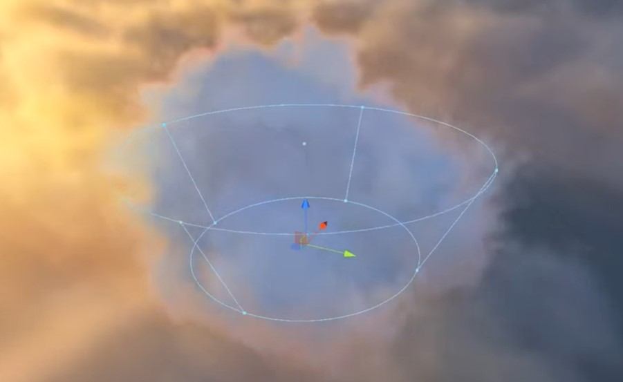
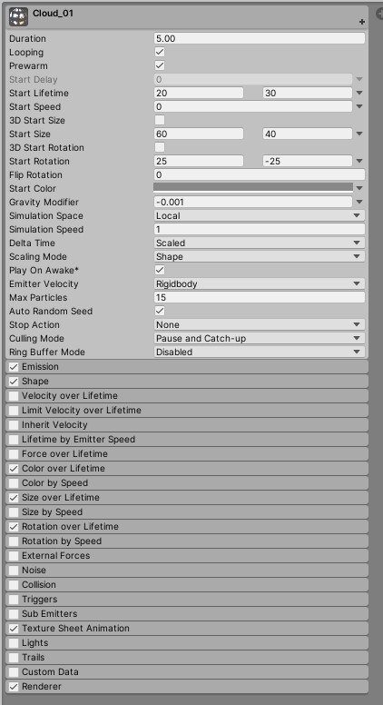
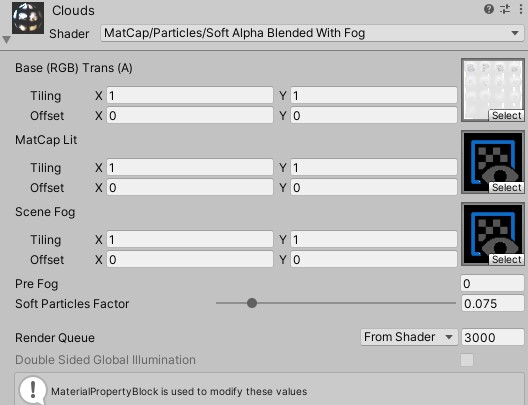
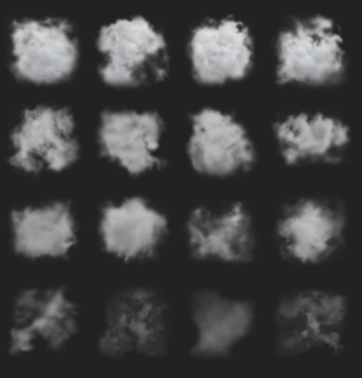

# UglyCloud_test002_Package
 
# UglyCloud_test002
_Watching clouds in the sky and guessing the shape of it is the most chill game we experienced before.The Ugly Cloud provided a peaceful way to present a possibitlity for peoples to argument some serious issues under this beautiful view._

_peaceful cloud and different sound and music trigger by sensors on the users hands_
## Step1. Clouds Scene
_procedural, 3d, raymarching, volumetric, lod, vr_
>
using an iconic [clouds shader](https://www.shadertoy.com/view/XslGRr) by iq , and custumize a run-time noise texture to becsuitable in Unity .algorithm : [here](https://www.shadertoy.com/view/4sfGzS).

1.Shader: Shader>Unlit>Clouds
>
2.Script:RuntimeTextureGenerator
>
## Step2. A MatCap Cloud _The overlay effect achieved by the shader provides the lighting style
_A MatCap is a 2D texture representing a 3D surface that includes lighting and reflections. As such, it doesn't require light and can drastically reduce CPU and GPU overhead. It simply overlays/projects the texture selected onto the mesh with the help of the mesh's normals._
>
https://www.youtube.com/watch?v=9mrk7URS2VM
>

(0)Create an Empty object
>
(1)Particle system
>

>
(2)Shader
>

>
Shader>MatCap>Particles>SoftAlphaBlendingwithFog
>

>
1.format:png
>

2.format:Custume render texture
>
_custom light probes. Each probe is a sphere with a texture with an orthographic camera attached. The orthographic camera is positioned in such a way that it captures the lighting probe at the proper proportions to be saved as a render texture that mimics a MatCap texture_
>
## Step3. Lighting and Fog
Tip: to get your particles to light properly
>
take the Normal Direction setting in the render drop-down to 0, or 0.05. This will bend the particle normals into a hemispherical shape
>Camera Setting: envirnment/skybox 
>
1.the primary lighting: perspective-corrected matcap
>
2.screenspace directional fog
>
3.screenspace edgelighting mask
>
## Step4. Making C4d Model of cloud
>
model from C4D to unity:https://www.youtube.com/watch?v=FGhI948mMQE
>
1.After downloading free 3D Modeling from online library, need to turn several object children into one single model.
>
>(right click)Select Children/(right click)Connect objects+Delete
>
2.Making enough Segments
>
>add Subdivisions Surface>(click on C)>take object out and thats it! 
>
3.Making animation by set the Dispacer>shader>Animation to speed 1
>
4.Export FBX Model and Animation
>
go to C4d Animation template/drag the object into Timeline/Function/Bake
vertex animation from C4D to unity:https://www.youtube.com/watch?v=r80iOjhjh1s
>
tryout steps: make a model version and an animation version in C4D
>
make a model be in unity first to try the cloud shader

## Step5. Sound Control and Design
>
>public class SoundController : MonoBehaviour
>{
>    public AudioSource goodSound;
>    public AudioSource badSound;
>
 >   // Start is called before the first frame update
 >   void Start()
 >   {
 >       badSound.Pause();
 >   }
>
 >   // Update is called once per frame
>    void Update()
 >   {
 >       if (Input.GetKeyDown(KeyCode.Space))
 >       {
 >           goodSound.Pause();
 >           badSound.Play();
 >       }
>
 >       if (Input.GetKeyUp(KeyCode.Space))
 >       {
 >           goodSound.Play();
 >           badSound.Pause();
 >       }
>    }
>}
>
>

## Reference:
**Custume Cloud in C4d
Effect A Tron**
_R21's Fog Volume Builder Settings as well as the new Volume material tag. How to export out anything into a .vdb file! Creating the cloud look through displacers and using Redshift to Light and texture our volume object and render our scene._
https://www.youtube.com/watch?v=E2xx7-4x5K0&list=PLrlN1DwkA0_YPifgoRPcQ48gnl-diPEWR&index=18&t=0s

**Unity Custom Cloud shaders
Howard Day**
_cloud shader driven by a perspective-corrected matcap for the primary lighting_
https://www.youtube.com/watch?v=BQcjsW8ldkw

**Unity Volumetric Clouds Shadery
Yuma Yanagisawa**
https://www.youtube.com/watch?v=-_CAELsrDqg&feature=youtu.be&fbclid=IwAR1uk0uTqRuAoeH0VTD-MBS8qT99pxUYmRp1_TMNqPNiPuX0irCbhgDuRZM

**Intro to Shader Coding in Unity - An Improvised Live Course
Freya Holmér**
https://www.youtube.com/watch?v=9WW5-0N1DsI

